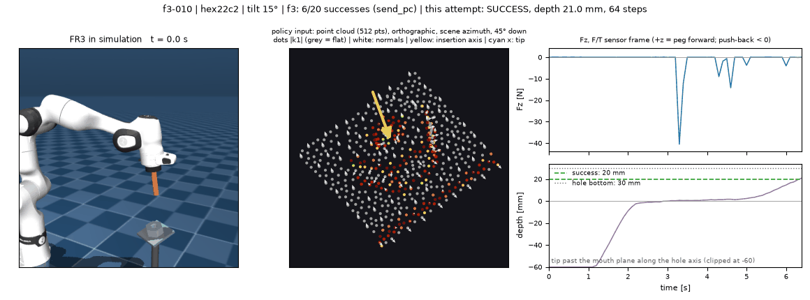
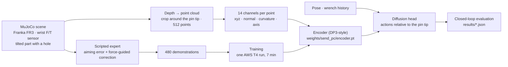

# Direction-aware point cloud encoder for force-aware peg insertion (Franka FR3, simulation)

I built a minimal direction-aware point cloud encoder: input a point cloud with per-point normals, principal curvatures (direction and magnitudes) and the nominal insertion axis (N×14) → output a trained encoder whose geometric embedding conditions a diffusion policy.
The policy is also conditioned on the end-effector pose and the wrist wrench history. It is trained on 480 simulated peg-in-hole demonstrations and evaluated closed loop on cases fixed before training.

> **Application context.** Prepared as application material for the semester project *Development of a Point Cloud Encoder for Force-Aware Manipulation Policy Learning* (IfA / inspire AG, with Bota Systems). Nothing here claims that work on that project has started; scope boundaries are in [What this is not](#what-this-is-not) and [Limitations and next steps](#limitations-and-next-steps).



*Case `f3-010`, closed loop with the expert disabled: the FR3 inserts a hexagonal peg into a hole tilted 15°, a tilt that never appears in training. Left: the scene. Middle: what the encoder sees (512 points, normals, the insertion axis). Right: wrist force Fz and insertion depth.*

**Results** (one config and one seed; every attempt is in `results/results.json`; peg shapes seen in training): hole tilt never seen in training f3 6/20 · training tilts train_control 6/10.

What is hard-coded: simulation only (MuJoCo 3.10, Franka FR3 model), ground-truth camera extrinsics, one fixed depth camera, a scripted expert that knows the hole pose up to a 0.5–1.8 mm aiming error and corrects it with wrist force, and the nominal insertion axis given as a task input.

## Pipeline at a glance



## Project fit at a glance

| Listing goal | What this repository does | Status |
|---|---|---|
| Depth / point cloud streams and camera calibration | One simulated depth camera turned into a point cloud, cropped using proprioception only; extrinsics are the simulator's ground truth | simulation stand-in |
| **Point cloud encoder that processes directional vector inputs** | DP3-style encoder over 14 channels (xyz, normal, curvature direction and magnitudes, insertion axis), trained end to end and loadable on its own | done at prototype scale |
| Fuse with force and proprioception to condition a diffusion policy | Encoder embedding + pose + wrench history condition a 1-D U-Net diffusion head | done |
| Evaluate transfer against vision and baseline encoders | Hole tilt never seen in training, plus point-cloud and wrench ablations; the RGB-only baseline is configured, not yet run | partial |

## Evidence snapshot

| finding | source |
|---|---|
| On a hole tilt never seen in training, f3 6/20 across six different cases | `results/pc.json` |
| The encoder drives the result: with another case's point cloud, f3 0/20; on training windows, the loss is 101.8× higher | `results/send_pc_ablate_pc_f3.json`, `results/check_floor_d1.txt` |
| Directions and force are read: swapping only the direction channels moves the predicted positions by 3.0 mm; zeroing the wrench in contact moves them by 0.9 mm, against a 0.5 mm threshold (half the per-side clearance) | `results/check_floor_d1.txt` |
| The encoder is trained (10,000 steps) and loads on its own; a fresh clone runs inference from the committed weights | `policy/check_encoder.py`, `scripts/smoke_test.sh` |

## What this is not

- Not a real-robot result: everything runs in MuJoCo, with no TACTO setup, no Bota sensor and no real camera.
- Not a benchmark: one object family, one seed.
- Not a claim that the force input improves success: the wrench is shown to be read, not to help.

## Quick start

Tested on macOS x86_64 with Python 3.12:

```bash
python3.12 -m venv .venv && .venv/bin/pip install -r requirements.txt
.venv/bin/python third_party/fetch_menagerie.py                                    # Franka FR3 model, pinned commit
bash scripts/smoke_test.sh                                                          # fresh clone -> committed weights -> one inference
.venv/bin/python -m eval.run --policy weights/send_pc --all --out results/pc.json  # closed-loop evaluation, about 20 min on CPU
```

Training: `python -m sim.gen_demos` (about 15 min), then `python -m policy.train --config configs/send_pc.json --device cuda`.

## How it works

- **Evaluation fixed first.** The cases, the success criterion (20 mm deep within 15 s) and every threshold were fixed in `eval/protocol.json` before training.
- **No simulator truth in perception.** The point cloud is cropped around the pin tip using proprioception only; a self-check poisons the true part pose and requires an identical observation.
- **Positions relative to the pin tip.** Point coordinates and position actions are relative to the pin tip, so every hole position becomes the same local problem (`policy/test_relative.py`).
- **An expert that needs force.** The expert aims with a small error and corrects it from the wrist force, so the demonstrations depend on the wrench.
- **Checks against a degenerate model** (table above) run on the committed weights, and every result records its config and weight hashes (`eval/check_floor.py`, `eval/audit_results.py`).

## Limitations and next steps

- Simulation only. Next: real depth streams on the TACTO setup, with automatic wrist and workspace camera calibration.
- Transfer to cross-section shapes that are not in training does not work yet, and tilts beyond the training range mostly fail. Next: an expert that searches the twist using wrist torque.
- RGB-only baseline: configured in `configs/send_rgb.json`, not yet run.
- One seed, a small U-Net sized for a CPU, and approximate curvature channels.

## Repo layout

```
sim/          scene, control, wrist F/T, point cloud and features, expert, demonstrations, checks
policy/       encoder, diffusion policy, training, checks
eval/         frozen protocol, closed-loop runner, floor check, audits, GIF
weights/      send_pc: the committed encoder and policy
results/      result JSON and check output
third_party/  dp3 (vendored, changes listed in SOURCE.md); FR3 model fetch script
```

## References

- Y. Ze et al., "3D Diffusion Policy", RSS 2024 (`YanjieZe/3D-Diffusion-Policy`, MIT; vendored at 47385d9).
- C. Chi et al., "Diffusion Policy", RSS 2023.
- M. Laskey et al., "DART: Noise Injection for Robust Imitation Learning", CoRL 2017.
- Franka FR3: MuJoCo Menagerie (Apache-2.0) at c96a32d.
